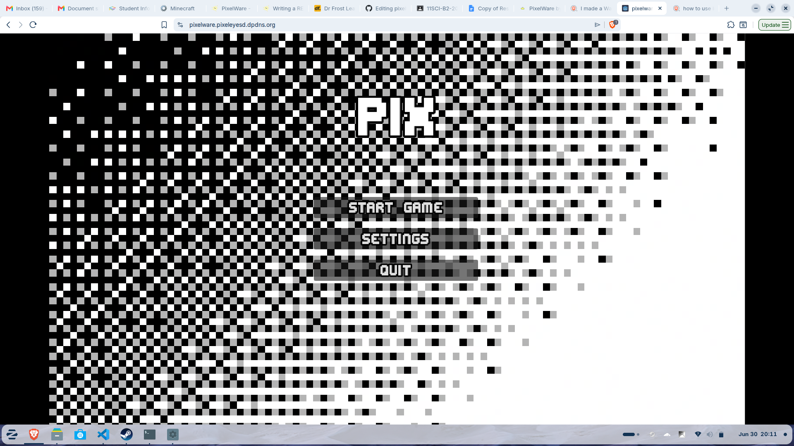
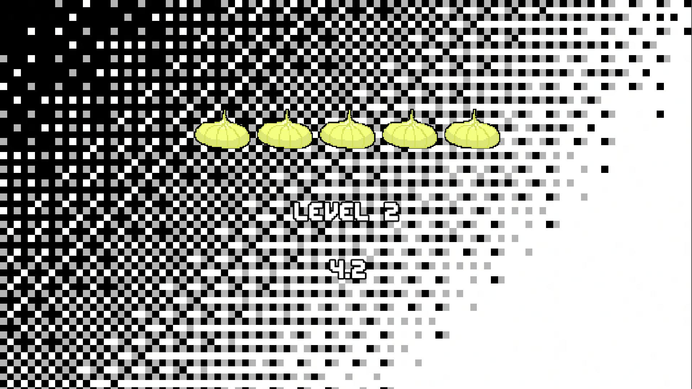
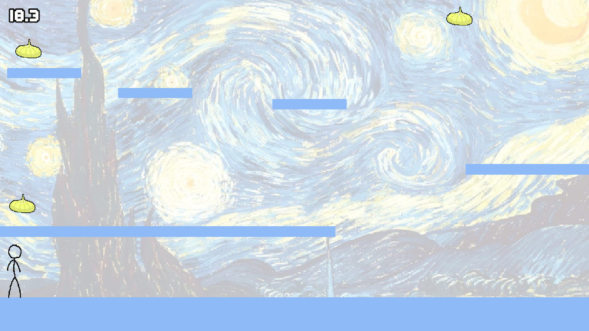
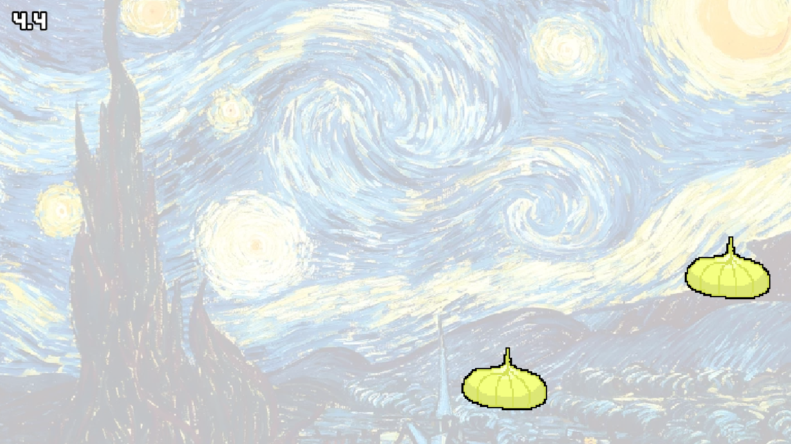

# PixelWare
A Warioware style game. Made in Godot!

Play here: https://pixelware.pixeleyesd.dpdns.org/

or here https://pixeleyesd.itch.io/pixelware

---

# Intro Timer

# Minigames
## platformer
A platformer using arrow keys and space to move around, collect three garlics before the timer runs out to go to the next level!

## Clicker  
You gotta click on the four garlics that appear randomly on screen before the timer runs out to proceed.

## Catch the falling garlics
You have to catch the 10 garlics without missing a single one to go to the win screen cuz you win after completing this last one :)

# Win screen

# Lose screen

